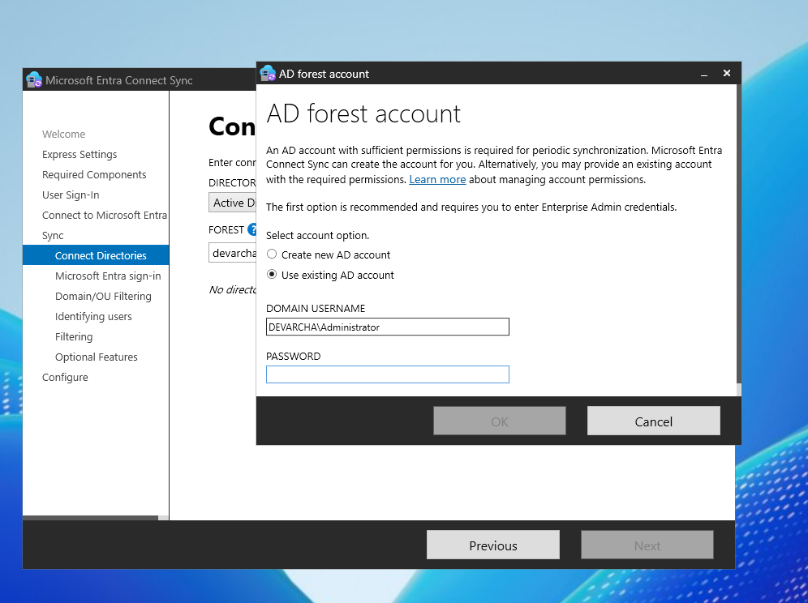
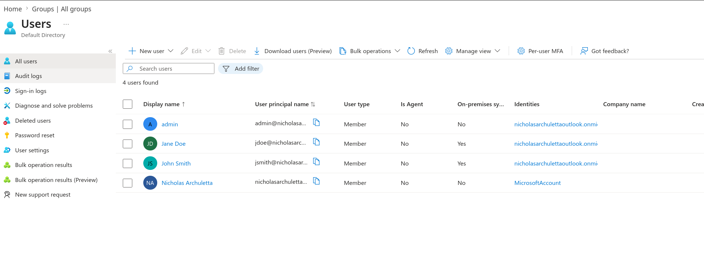
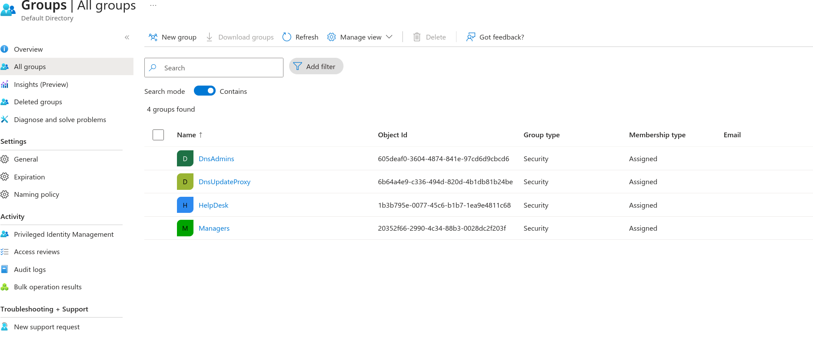
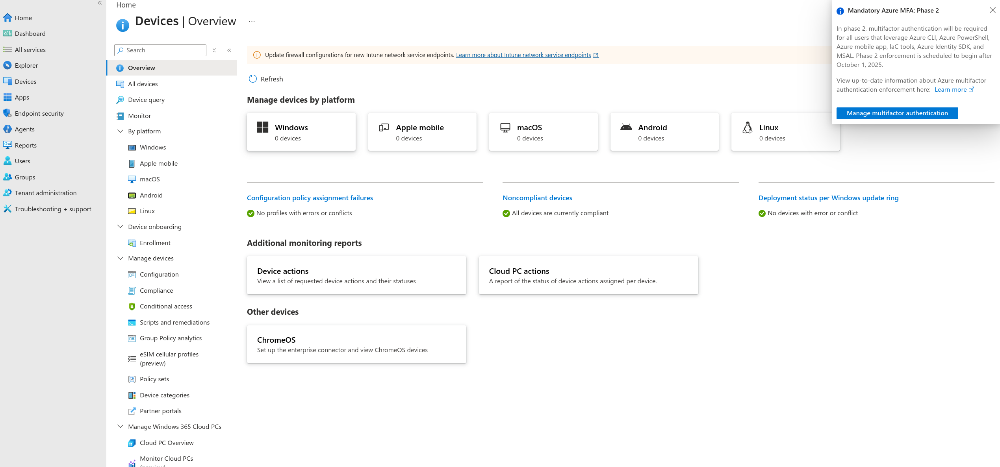
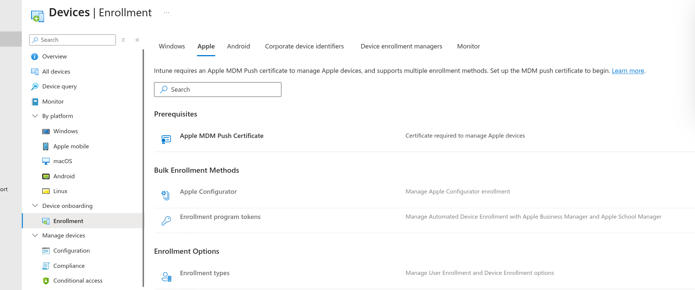
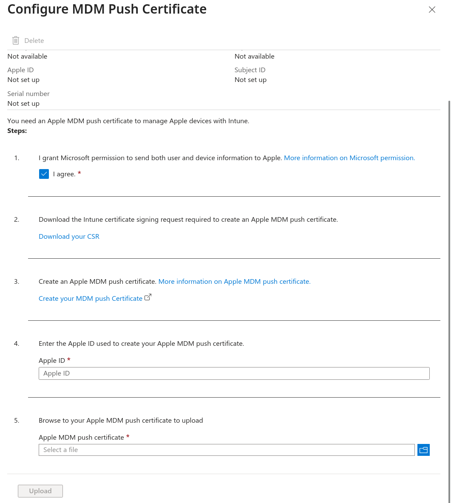
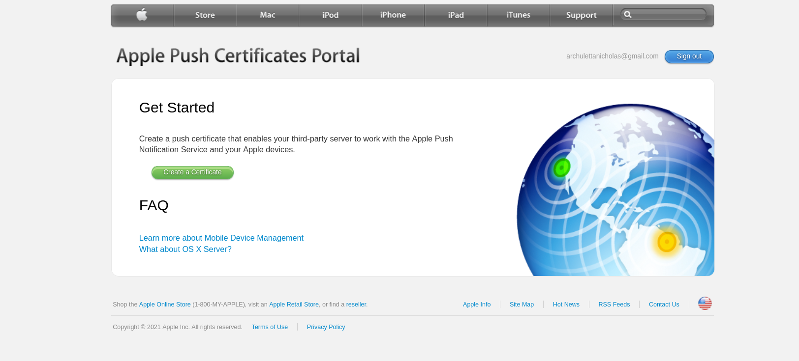
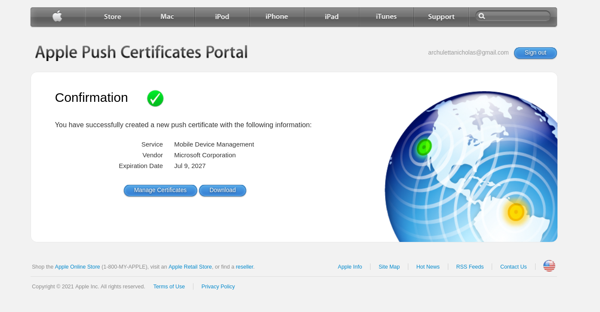

# windows-hybrid-lab
This lab I deployed windows server AD, entra connect, and intune.

This repo is publicly accessible on:
- [GitHub](https://github.com/NichArchA82/windows-hybrid-lab)
- [gitea](https://git.devarcha.com/NichArchA82/windows-hybrid-lab) A self hosted gitea mirror

The start of the lab I used Rob Merrill's (learnbuilddeploylabs) [Active Directory Repo](https://github.com/learnbuilddeploylabs/active-directory-home-lab) on GitHub.
Following that repo I deployed a Windows server 2019 for Active Directory, and a Windows 11 Client (CLIENT01) Since Windows 10 Enterprise Evaluation is End of Life.
Finishing this lab I have deployed two additional Windows client machines:
- CLIENT02 (Windows 11 Enterprise Evaluation) for testing intune as a corportate owned device.
- CLIENT03 (Windows 10 professional) using an old iso I had laying around to test windows compliance settings in intune.

Additionally, there was another Windows server deployed (Windows 2025) that entra connect was installed on to create a hybrid setup between the local Active Directory servers and the cloud.

Finally intune was tested on an iPad, and an Android s22 phone.

NOTES setting up Active Directory and issues I ran into.
corp.local was changed to mydomain.local

Trying to domain join CLIENT01 ran into some issues. The first issue was that we set the dns to DC01 located at the ip 192.168.100.10 and was relying on the dhcp of vmworkstation pro to handle the ip on the host only adapter. The issue that I ran into, was that the dhcp server on vmworkstation handed out a 172.16.x.x ip so CLIENT01 could not reach the DC01 network without a router that was not configured. I opted to set a static ip and assigned CLIENT01 192.168.100.11 and was able to join it to the domain.

Following the lab, I created an Oraganizational Units, created some users with passwords, and pushed a legal Group Policy Object to CLIENT01 that was put in the HR security group stating authroized personnel are only allowed to use the machine.

Then I worked on entra connect. In order to install this, I needed a server to put it on. I chose to deploy a Windows server 25 to create the entra connect server in my homelab.
Following similiar options in workstation, I select 2025 and call it ECS01 (entra connect server 01). I gave it 4gb of ram and 2 vcpus like the others, and add a host only adapter like the other machines configured in the domain. I then will start it and install windows standard desktop experience. After it is installed, we need to create an Administrator password. then set a computer name, and install vmware tools then restart. I then downloaded the entra connect server. I ran into an issue where my test account was a guest account, so I had to create an admin account for my tenent. After signing in with this newly created admin account, I needed to sign into the Active Directory server. I used the Administrator account on the Active Directoy server.

I selected create new AD account to have entra connect create a new account with the correct permissions to sync.

Once I got it configured, I was able to see the accounts and security groups I created on my AD Server from the Active Directory Lab inside entra in the cloud.

*List of the users that show up in entra. NOTE: Since I used corp.local when deploying the lab, the usernames changed to upn.onmicrosoft.com This means that users such as Jane Doe had to log in as jdoe@upn.onmicrosoft.com instead of just jdoe@mycorp*

*List fo the groups that show up in entra.*

I went to https://admin.microsoft.com and signed up for an Intune trial then created the intune_test user account that I assigned one of the 25 licenses to in the tenent. 
After setting up the trial, I was greeted with the Intune home screen.

The first device I set up was my iPad. First I navigated to Devices -> Enrollment -> Apple

An Apple MDM Push Certificate is required to enroll my iPad, so I selected that option

This requires you to accept an agreement, download your certificate signing request, create an MDM push certificate from Apple, then choose the Apple ID that was used to create the MDM push certificate, and upload the certificate back to intune.

To create the Apple Push Certificate, I went to the [Apple Push Certificates portal](https://identity.apple.com/pushcert).

Following the steps in the portal, I then uploaded the CSR I got fromMicrosoft Intune, then got my MDM Push Cert.

*This certificate expires yearly, so it will need to be redone to keep managing Apple devices with Intune.

